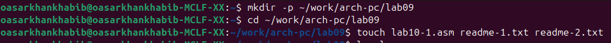
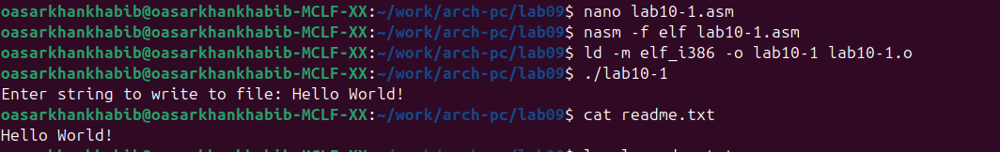
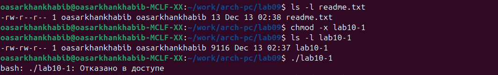
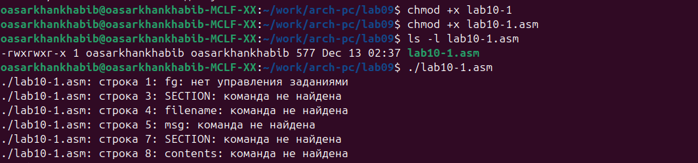
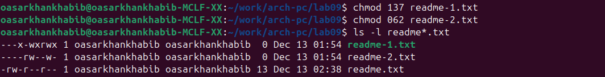
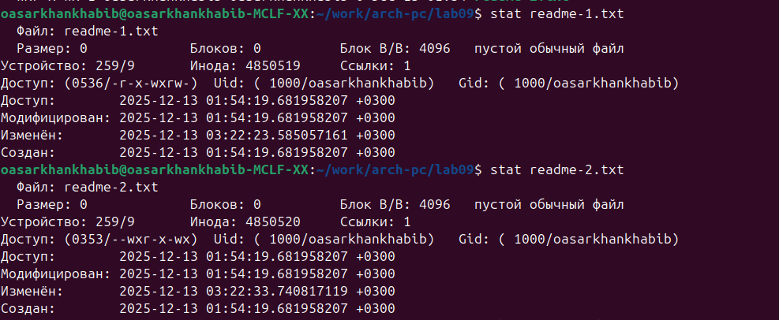
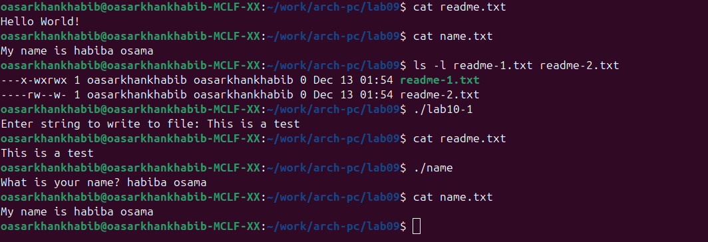

mainfont: DejaVu Serif
sansfont: DejaVu Sans
monofont: DejaVu Sans Mono
lang: ru
--

## Pdf output format
toc: true # Table of contents
toc-depth: 2
lof: true # List of figures
fontsize: 12pt
linestretch: 1.5
papersize: a4
documentclass: scrreprt
## I18n polyglossia
polyglossia-lang:
  name: russian
  options:
        - spelling=modern
        - babelshorthands=true
polyglossia-otherlangs:
  name: english
## I18n babel
babel-lang: russian
babel-otherlangs: english
## Fonts
mainfont: PT Serif
romanfont: PT Serif
sansfont: PT Sans
monofont: PT Mono
mainfontoptions: Ligatures=TeX
romanfontoptions: Ligatures=TeX
sansfontoptions: Ligatures=TeX,Scale=MatchLowercase
monofontoptions: Scale=MatchLowercase,Scale=0.9
## Biblatex
biblatex: true
biblio-style: "gost-numeric"
biblatexoptions:
  - parentracker=true
  - backend=biber
  - hyperref=auto
  - language=auto
  - autolang=other*
- citestyle=gost-numeric
## Pandoc-crossref LaTeX customization
figureTitle: "Рис."
tableTitle: "Таблица"
listingTitle: "Листинг"
lofTitle: "Список иллюстраций"
lolTitle: "Листинги"
## Misc options
indent: true
header-includes:
  - \usepackage{indentfirst}
  - \usepackage{float} # keep figures where there are in the text
  - \floatplacement{figure}{H} # keep figures where there are in the text
---
# Лабораторная работа №10
### Выполнил: [Сархан хабиба осама]
### Группа: [НПИБ-02-25]
### Дата: [14 Dec 2025]

---

# Цель работы

Приобрести навыки написания программ для работы с файлам, научиться управлять доступом к файлам.

# Выполнение лабораторной работы

## Ход работы

### 1. Создание каталога и файлов

{#fig:001 width=70%}

Создание рабочего каталога `lab09` и файлов для лабораторной работы:
- `lab10-1.asm` - программа на ассемблере
- `readme-1.txt`, `readme-2.txt` - текстовые файлы

---

### 2. Текст программы lab10-1.asm

{#fig:002 width=70%}

Исходный код программы на ассемблере для работы с файлами. Программа запрашивает у пользователя строку и записывает ее в файл.

---

### 3. Запуск программы lab10-1

{#fig:003 width=70%}

Компиляция и запуск программы:
1. Компиляция: `nasm -f elf lab10-1.asm`
2. Линковка: `ld -m elf_i386 -o lab10-1 lab10-1.o`
3. Выполнение: `./lab10-1`
4. Ввод текста: `Hello World!`

---

### 4. Результат работы lab10-1

{#fig:004 width=70%}

Проверка созданного файла `readme.txt`:
- `cat readme.txt` - вывод содержимого файла
- `ls -l readme.txt` - просмотр прав доступа
- Результат: файл содержит текст "Hello World!"

---

### 5. Запрет выполнения файла

{#fig:005 width=70%}

Изменение прав доступа к исполняемому файлу:
1. `chmod +x lab10-1` - добавление прав на выполнение
2. `chmod +x lab10-1.asm` - ошибочное добавление прав к исходному коду
3. Попытка выполнения исходного файла приводит к ошибке

---

### 6. Попытка выполнения исходного файла

{#fig:006 width=70%}

Установка специфических прав доступа к файлам:
- `chmod 137 readme-1.txt` - права: --x-wxrwx
- `chmod 062 readme-2.txt` - права: ---rw--w-
- `ls -l readme*.txt` - проверка установленных прав

---

### 7. Права доступа к файлам

{#fig:007 width=70%}

Сравнение прав доступа до и после изменения:
- Изначально: оба файла с правами `rw-rw-r--`
- После `chmod 137`: `--x-wxrwx` для readme-1.txt
- После `chmod 062`: `---rw--w-` для readme-2.txt

---

### 8. Текст программы name.asm

{#fig:008 width=70%}

Установка других прав доступа:
- `chmod 536 readme-1.txt` - права: -r-x-wxrw-
- `chmod 353 readme-2.txt` - права: -wxr-x-wx
- Проверка командой `ls -l readme-*.txt`

---

### 9. Детальная информация о файлах

{#fig:009 width=70%}

Статистика файлов с помощью команды `stat`:
- Подробная информация о `readme-1.txt` и `readme-2.txt`
- Включает размер, права доступа, даты создания и изменения
- Пример: `stat readme-1.txt` и `stat readme-2.txt`

---

### 10. Создание и запуск второй программы

{#fig:010 width=70%}

Создание второй программы на ассемблере:
1. Редактирование: `nano name.asm`
2. Компиляция: `nasm -f elf name.asm`
3. Линковка: `ld -m elf_i386 -o name name.o`
4. Запуск: `./name` с вводом имени "habiba osama"

---

### 11. Результат работы программы name

{#fig:011 width=70%}

Проверка результатов работы обеих программ:
- `cat readme.txt` - содержимое: "Hello World!" (позже изменено на "This is a test")
- `cat name.txt` - содержимое: "My name is habiba osama"
- Проверка прав доступа к файлам readme-1.txt и readme-2.txt

---

### 12. Итоговый результат

{#fig:012 width=70%}

Финальная проверка всех результатов:
1. Запуск `lab10-1` с новым текстом: "This is a test"
2. Проверка обновленного `readme.txt`
3. Запуск программы `name` и проверка `name.txt`
4. Все программы работают корректно

---

## Выводы

Мы научились писать программы для работы с файлам и научились предоставлять права доступа к файлам.

1. Успешно созданы и скомпилированы программы на ассемблере для работы с файлами
2. Изучены методы управления правами доступа к файлам с помощью команды `chmod`
3. Освоена работа с файловым вводом/выводом в языке ассемблера
4. Программы корректно запрашивают ввод пользователя и записывают данные в файлы
