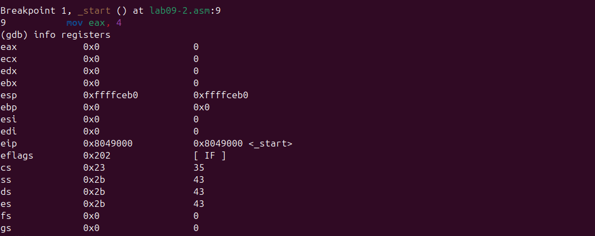
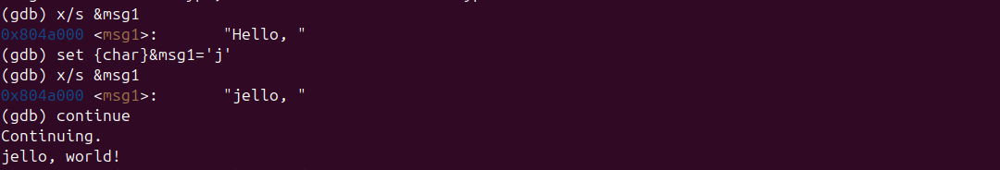

mainfont: DejaVu Serif
sansfont: DejaVu Sans
monofont: DejaVu Sans Mono
lang: ru
--

## Pdf output format
toc: true # Table of contents
toc-depth: 2
lof: true # List of figures
fontsize: 12pt
linestretch: 1.5
papersize: a4
documentclass: scrreprt
## I18n polyglossia
polyglossia-lang:
  name: russian
  options:
	- spelling=modern
	- babelshorthands=true
polyglossia-otherlangs:
  name: english
## I18n babel
babel-lang: russian
babel-otherlangs: english
## Fonts
mainfont: PT Serif
romanfont: PT Serif
sansfont: PT Sans
monofont: PT Mono
mainfontoptions: Ligatures=TeX
romanfontoptions: Ligatures=TeX
sansfontoptions: Ligatures=TeX,Scale=MatchLowercase
monofontoptions: Scale=MatchLowercase,Scale=0.9
## Biblatex
biblatex: true
biblio-style: "gost-numeric"
biblatexoptions:
  - parentracker=true
  - backend=biber
  - hyperref=auto
  - language=auto
  - autolang=other*
  - citestyle=gost-numeric
## Pandoc-crossref LaTeX customization
figureTitle: "Рис."
tableTitle: "Таблица"
listingTitle: "Листинг"
lofTitle: "Список иллюстраций"
lolTitle: "Листинги"
## Misc options
indent: true
header-includes:
  - \usepackage{indentfirst}
  - \usepackage{float} # keep figures where there are in the text
  - \floatplacement{figure}{H} # keep figures where there are in the text
---
# Лабораторная работа №9
## Понятие подпрограммы. Отладчик GDB

### Выполнил: [Сархан хабиба осама]
### Группа: [НПИБ-02-25]
### Дата: [7 декабрь 2025]

---

## 1. Цель работы
Приобретение навыков написания программ с использованием подпрограмм. 
Знакомство с методами отладки при помощи GDB и его основными возможностями.

## 2. Теоретическая часть
### 2.1. Понятие подпрограммы
Подпрограмма — функционально законченный участок кода, который можно многократно вызывать из разных мест программы.

### 2.2. Основные команды GDB
- `break` - установка точки останова
- `run` - запуск программы
- `stepi` / `nexti` - пошаговое выполнение
- `info registers` - просмотр регистров
- `x` - просмотр памяти
- `set` - изменение значений
- `continue` - продолжение выполнения

## 3. Практическая часть

### 3.1. Программа с подпрограммой (lab09-1.asm)
**Код программы:**
```
assembly
%include 'in_out.asm'

SECTION .data
msg: DB 'Введите x: ',0
result: DB 'Результат: ',0

SECTION .bss
x: RESB 80
tmp: RESB 80

SECTION .text
GLOBAL _start

_start:
    mov eax, msg
    call sprint
    
    mov ecx, x
    mov edx, 80
    call sread
    
    mov eax, x
    call atoi
    
    call calc
    
    mov [tmp], eax
    
    mov eax, result
    call sprint
    
    mov eax, [tmp]
    call iprintLF
    
    call quit

calc:
    mov ebx, 2
    mul ebx
    add eax, 7
    ret
```
Результат выполнения программы:
Введите x: 5
Результат: 17

Скриншот выполнения:


Пояснение: Программа вычисляет выражение 2x+7 с использованием подпрограммы calc.

3.2. Отладка программы в GDB (lab09-2.asm)
3.2.1. Исходный код
SECTION .data
msg1: db "Hello, ",0
msg2: db "world!",10

SECTION .text
global _start

_start:
```
    mov eax, 4
    mov ebx, 1
    mov ecx, msg1
    mov edx, 7
    int 0x80
    
    mov eax, 4
    mov ebx, 1
    mov ecx, msg2
    mov edx, 7
    int 0x80
    
    mov eax, 1
    mov ebx, 0
    int 0x80
```
3.2.2. Процесс отладки
Шаг 1: Установка точки останова и запуск
(gdb) break _start
(gdb) run

Шаг 2: Просмотр регистров
(gdb) info registers

Скриншот регистров:


Регистры до начала выполнения: все инициализированы нулями.

Шаг 3: Просмотр содержимого памяти
(gdb) x/s &msg1
Вывод: 0x804a000 <msg1>: "Hello, "
Шаг 4: Изменение памяти
(gdb) set {char}&msg1='j'
Шаг 5: Проверка изменения
(gdb) x/s &msg1
(gdb) x/s &msg1
Вывод: 0x804a000 <msg1>: "jello, "
Шаг 6: Продолжение выполнения
(gdb) continue

Вывод программы: jello, world!
Скриншот финального вывода:




3.3. Программа с аргументами командной строки (lab09-3.asm)
SECTION .text
global _start

_start:
```
    mov eax, 1
    mov ebx, 0
    int 0x80
```
Компиляция и запуск с аргументами:
nasm -f elf lab09-3.asm
ld -m elf_i386 -o lab09-3 lab09-3.o
gdb --args ./lab09-3 аргумент1 аргумент2

4. Задание для самостоятельной работы

4.1. Исправление программы (3+2)*4+5
Оригинальная (ошибочная) программа:
```
mov ebx,3
mov eax,2
add ebx,eax      ; ebx = 5
mov ecx,4
mul ecx          ; ОШИБКА: умножает eax=2, а не ebx=5
add ebx,5
```

Исправленная программа:
```
mov eax, 3
add eax, 2      ; eax = 5
mov ebx, 4
mul ebx         ; eax = 20
add eax, 5      ; eax = 25
```
5. Выводы

 Освоены подпрограммы: научились создавать и вызывать подпрограммы с помощью инструкций CALL и RET.

 Освоен GDB: приобретены практические навыки работы с отладчиком:

   Установка точек останова

   Пошаговое выполнение программ

   Просмотр и изменение регистров

   Просмотр и изменение памяти

   Работа с аргументами командной строки

 Практический результат: успешно изменено содержимое памяти во время выполнения программы (замена "Hello" на "jello").

 Найдена и исправлена ошибка: в программе вычисления выражения (3+2)*4+5 обнаружена логическая ошибка и предложено исправление.
